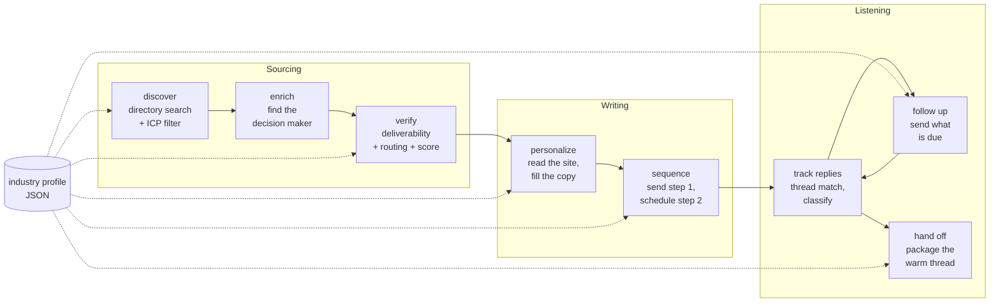

# ColdSpark Next

A cold outreach engine that researches each company before it writes, sends on
its own schedule, tracks its own email threads, and stops the moment a human
answers. Every vertical is a config file, not a code change.

```bash
git clone https://github.com/joydai2026-del/coldspark.git
cd coldspark
npm install
npm run demo          # full pipeline over fabricated sample data, sends nothing
```

That is the whole setup. No API keys, no database, no network calls.

---

## What it does

Cold outreach fails in specific, boring ways: you email an address that bounces
and burn the sending domain, you greet a shared `info@` mailbox by a person's
first name, you keep following up on someone who already replied, or you fire a
"great, here's my calendar" answer at a vacation auto-responder. Each of those
is a rule, and the rules are what this repo is.

The engine runs eight stages in one direction. Each stage reads leads in a given
lifecycle state, does one job, and writes them back. Running the whole thing
again over already-processed leads is a no-op, which is what makes it safe on a
cron.



**Config-driven per industry.** An industry profile holds the search queries,
the blocklist, the deliverability policy, the scoring ladder, the sequence copy
and cadence, the send window, and the send cap. Two profiles ship
(`config/industries/accounting.json`, `dental.json`). `npm run demo:dental`
runs the same engine against the other one, and the different results come
entirely from the file:

| | accounting | dental |
|---|---|---|
| qualify threshold | 40 | 50 |
| a risky address | held for review | dropped |
| send window | Mon to Fri, 09:00 to 17:00 New York | Mon to Thu, 10:00 to 16:00 New York |
| send cap per run | 40 | 15 |
| sequence | 4 steps over 12 working days | 2 steps over 4 working days |

**It researches before it writes.** The personalize stage takes what the
company says about itself and turns it into the placeholder values for that one
lead. A lead whose placeholders cannot all be filled is held, never sent:
shipping a literal `{company_hook}` to a prospect is worse than shipping
nothing. This is the stage the public
[ColdSpark](https://github.com/joydai2026-del/coldspark) app implements as a
product (upload a CSV, it fetches each homepage and has Claude write the copy).
Here it is one port with one contract, so ColdSpark, a different model, or a
hand-written rule set all drop in without any other stage noticing.

**It tracks its own threads.** Every outbound message gets a real Message-ID,
kept on the lead. A reply is matched back by its `In-Reply-To` or `References`
header, so a reply from a colleague's mailbox days later still lands on the
right lead. The from-address is only the fallback.

**It follows up on its own schedule.** The next step's due date is written at
send time, in business days, clamped into the profile's send window. The window
is read in the profile's IANA time zone, so "09:00 to 17:00" is the recipient's
morning whether the job runs on a laptop or in a UTC container, and it survives
a daylight-saving change. It is checked again at dispatch, not only when the
step was scheduled, so a cron that fires at midnight sends nothing rather than
turning a 09:00 follow-up into a 23:00 one. Beyond that the follow-up stage is
stateless: it sends whatever is due right now, and on a day when nothing is due
it sends nothing.

**It knows when to stop.** A real reply stops the sequence. An unsubscribe
disqualifies the lead permanently. An out-of-office does neither: it is caught
deterministically from RFC 3834 headers before any classifier runs, and it
pushes the next step out to the return date the sender stated.

---

## The dry run

`npm run demo` plays two fixed ticks, Monday's send and Thursday's check, so one
command shows both halves of the loop. In production those are two separate
scheduled invocations. The sample data is fabricated and shaped so that each
routing outcome appears at least once (see `sample-data/README.md`). Two rules
the sample set does not reach, the fail-closed path when a verifier is offline
and the profile that drops risky addresses instead of holding them, are covered
in the unit tests instead.

```
  STAGE           RESULT
  --------------------------------------------------------------------------
  discover        returned=14  icp_rejected=1  below_rating_floor=1  already_known=4  added=8
  enrich          considered=8  contacts_found=4  no_contact=4
  verify          considered=8  owner=1  general=5  manual_review=1  dropped=1  demoted_to_general=1  qualified=6
  personalize     considered=6  researched=5  no_research=1
  sequence        eligible=5  sent=5
  track-replies   fetched=4  auto_reply=1  positive=1  negative=1  unsubscribe=1
  follow-up       in_sequence=2  due=1  sent=1  waiting=1
  hand-off        replied=2  handed_off=1  needs_human=1
                  note: 1 replies were not positive and stay with a human

  LEAD                          TRACK          LIFECYCLE     SENT  NEXT / OUTCOME
  ----------------------------------------------------------------------------------------------
  Northgate Books               owner          handed_off    1     reply: positive
  Harborlight Tax Group         general        in_sequence   1     next step 2026-03-16
  Quill CPA Studio              manual_review  disqualified  0     dropped:undeliverable
  Maple Ledger Associates       general        replied       1     reply: negative
  Bayonne Tax Services          general        disqualified  1     reply: unsubscribe
  Summit Books and Payroll      manual_review  enriched      0     verdict:risky
  Cedar Close CPA               general        in_sequence   2     next step 2026-03-11
  Ironwood Accounting Co-op     manual_review  verified      0     held:no_research
```

Read down that lead table and you can see every rule firing:

- **Northgate Books** had a verified named partner, so it went out on the owner
  track greeted by name, and the positive reply was handed off.
- **Harborlight Tax Group**'s personal address bounced, so the engine fell back
  to the role mailbox and dropped the person's name along with it. The reply was
  an out-of-office, so the lead is still in sequence, resuming after March 16.
- **Quill CPA Studio** had no deliverable address at all. Dropped, and the
  domain is remembered so a later run does not pay to look it up again. That
  memory is in process unless you pass `--state`, which persists it with a TTL.
- **Bayonne Tax Services** is in the list at all because the blocklist matches
  whole words: a naive substring check on "ey" would have thrown it away.
- **Cedar Close CPA** had a named contact with no job title. The verified
  personal address is still used, but the lead is demoted to the general track
  so the copy says "Hi there" rather than shipping a half-known "Hi Lena". It
  never replied, so it is the one lead that got a second step on Thursday.
- **Summit Books and Payroll** and **Ironwood Accounting Co-op** are both held
  for a human, one because the address is risky, one because there was nothing
  to research.

Other commands:

```bash
npm run run -- industries                        # list the profiles
npm run run -- validate --industry dental        # validate one profile
npm run run -- run -i accounting --dry-run --out out/report.json
npm run run -- run -i accounting --dry-run --state .state   # persist, then re-run
npm test                                         # 92 tests
npm run typecheck
```

`--state` is worth trying twice. The first run sends five messages; the second
sends none, because the lifecycle guards and the persisted store make a re-run a
no-op. That property is asserted in the test suite by actually shelling out to
the CLI twice against a temp directory.

---

## Layout

```
src/
  core/       types, lifecycle state machine, config loading + validation,
              scoring, ICP filter, business-day clock, lead store
  ports/      the six provider contracts (lead source, enricher, verifier,
              personalizer, mailer, inbox)
  providers/  fixture implementations of all six, reading sample-data/
  stages/     discover, enrich, verify, personalize, sequence, replies,
              followup, handoff, plus the auto-reply detector and classifier
  pipeline.ts the eight stages, wired
  cli.ts
config/industries/   one JSON file per vertical
sample-data/         fabricated companies and replies (see its README)
tests/               92 tests, no network, no fixtures beyond sample-data
```

Nothing in `src/stages` imports a vendor SDK, and nothing in `src/stages` knows
an industry name. Swapping the verifier from one provider to another, or the
personalizer from a rule set to a model, is a new file in `src/providers` and
one line where the pipeline is wired.

### The rule the whole thing is built around

`routeContact` in `src/stages/verify.ts` is the safety boundary, and it is
worth reading if you read nothing else:

1. Verifier unavailable and the profile is fail-closed, hold everything. Never
   fall open to sending unverified mail.
2. Enriched personal address verifies clean, use it, owner track.
3. Enriched address is undeliverable and there is no role mailbox, drop the
   lead and remember the domain.
4. Role mailbox verifies clean, use it on the general track with the name and
   title cleared, because the person is no longer the recipient.
5. Anything risky, or any provider failure, follows the profile's
   `riskyPolicy`: `manual_review` hands it to a human (accounting), `drop`
   discards it (dental). What it never does is send. A verifier that guesses
   "valid" when it does not know is how a sending domain gets burned.

A sixth rule sits just after routing: an owner-track contact missing a full
name or a title is demoted to the general track. That changes the copy, not the
address. The verified personal mailbox is still the recipient, it just gets the
generic greeting, because the alternative is "Hi Lena," over a signature block
that does not know who Lena is.

---

## What is distilled and what is illustrative

This repo is a distillation of a private production system I built and ran. It
is not that codebase with the names removed, and nothing here should be read as
evidence of that system's results. What it is: the rules that system taught me,
rewritten to stand alone. Being precise about which part is which:

| Stage | Status | Note |
|---|---|---|
| ICP filter, whole-word blocklist | **Distilled** | Same rule, same word-boundary bug it exists to prevent |
| Dropped-domain memory with TTL | **Distilled** | Same purpose: stop re-paying for a domain that already failed |
| Contact routing (`routeContact`) | **Distilled** | The five-branch rule above, generalized off its original vendors |
| Verifier abstraction, 4-class verdict | **Distilled** | Providers map their own raw result onto valid / invalid / risky / api_failed |
| Owner-track demotion on missing name or title | **Distilled** | Same guard against a hollow greeting |
| Deterministic lead scoring | **Distilled**, made config-driven | Production hard-coded one weight ladder; here it is per profile |
| Lifecycle state machine | **Distilled** | Same idempotent-rewrite property that makes cron re-runs safe |
| Out-of-office detection | **Distilled** | Same RFC 3834 header signals plus a conservative phrase list |
| Reply classification taxonomy | **Distilled** taxonomy, **rewritten** implementation | Production asks a small model. This ships a deterministic rule classifier behind the same interface so the demo needs no key |
| Thread tracking by Message-ID | **Distilled** concept, **rewritten** | Production reads IMAP headers off a live mailbox |
| Follow-up scheduler | **Rewritten** | Production delegated warmed sending and step delays to a third-party sending platform. The business-day scheduler here is written for this repo |
| Personalize | **Illustrative** here, real elsewhere | The port is real, the fixture implementation is string rules. The production implementation of this stage is the public ColdSpark app |
| Hand off | **Illustrative** | Production continued into meeting prep, proposals, and invoicing. That is a different product, and dragging it in would make this repo about billing |
| Live provider adapters | **Not included** | No directory, enrichment, verification, sending, or IMAP adapters ship here. `coldspark run` without `--dry-run` refuses to start |

The private system also carried things a portfolio repo has no business
carrying: a spreadsheet-backed CRM a human edited in parallel, circuit breakers
around specific vendor APIs, per-agent cost tracking, and a chat-based alerting
path. Those were left out on purpose rather than half-ported.

No client data, contact, campaign result, or credential from that program
appears anywhere in this repository or its history. Every name, domain, address,
and phone number in `sample-data/` is invented, on reserved TLDs that cannot
resolve.

---

## Using it for real

Write adapters for the six interfaces in `src/ports/index.ts` and wire them
where `src/cli.ts` currently wires the fixtures. The engine does not care which
vendors you pick. Two things it will hold you to:

- The verifier must map its raw responses onto the four verdicts honestly. If
  "unknown" gets mapped to `valid`, every guard downstream is decoration.
- The mailer must return a stable Message-ID for each send, or thread matching
  degrades to address matching.

### Known limitations, stated rather than hidden

- **The send cap is per run, not per day.** `sendCapPerRun` is named for what it
  does. Schedule the engine hourly and it can send that many every hour. A true
  daily cap needs a counter that persists across runs, keyed by calendar date in
  the profile's zone.
- **No provider idempotency key.** State is written after every send, so a crash
  loses at most one record, but a crash in the window between the provider
  accepting a message and that write can still duplicate one message on the next
  run. Closing that properly means sending a caller-supplied idempotency key.
- **Reply lookback is a heuristic, not a cursor.** Each run asks the inbox for
  everything since the oldest unanswered send, and relies on Message-ID dedup
  plus idempotent transitions. That is correct but does more work over time than
  a stored cursor would.
- **The lead store is a JSON file.** Fine for a few thousand leads and one
  process. Concurrent runs would need real transactions.
- **Held leads need a human.** A lead parked at `manual_review` waits for a
  person to fix the address or the contact. There is no recovery loop that
  re-picks them up automatically.

Then add your vertical as a JSON file in `config/industries/`. The loader
validates it, including that every `{placeholder}` your copy uses is one the
personalizer has been told to produce, so a broken profile fails at load rather
than in someone's inbox.

## License

MIT. See [LICENSE](LICENSE).
