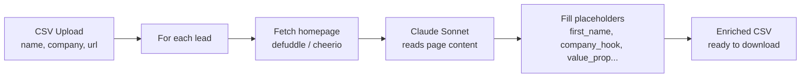

# ColdSpark

AI-powered cold outreach personalizer. Upload a CSV of leads (name, company, URL), paste a template with `{placeholders}`, and ColdSpark fetches each company's homepage, reads it with Claude, and writes specific, genuine copy for every lead.

[](https://vercel.com/new/clone?repository-url=https://github.com/joydai2026-del/coldspark&env=ANTHROPIC_API_KEY&envDescription=Your%20Anthropic%20API%20key&project-name=coldspark&repository-name=coldspark)


---

## How It Works



1. Upload CSV with `name`, `company`, `url` columns (max 25 rows)
2. Paste a template like:

   ```
   Hi {first_name}, I noticed {company} is {company_hook}. {value_prop}
   ```

3. ColdSpark fetches each company's homepage (via defuddle or cheerio fallback)
4. Claude Sonnet reads the page and fills every `{placeholder}` with specific content
5. Download the enriched CSV with one filled column per placeholder

---

## Example

**Template:**
```
Hi {first_name},

I noticed {company} is {company_hook}. We help teams like yours {value_prop}.

Worth a 15-minute call this week?
```

**Input CSV row:**
```csv
name,company,url
Sarah Chen,Retool,https://retool.com
```

**Output (after Claude reads retool.com):**
```
Hi Sarah,

I noticed Retool is making it dramatically faster for developers to build
internal tools — with a drag-and-drop UI that connects directly to any
database or API. We help teams like yours cut the time spent on custom
dashboards by automating the data-prep layer before it hits Retool.

Worth a 15-minute call this week?
```

The same template, run against a different lead, produces a completely different email grounded in that company's actual homepage.

---

## Local Setup

```bash
git clone https://github.com/joydai2026-del/coldspark.git
cd coldspark
npm install

# Set your Anthropic API key
cp .env.local.example .env.local
# Edit .env.local and paste your ANTHROPIC_API_KEY

npm run dev
# Open http://localhost:3000
```

---

## Environment Variables

| Variable | Required | Description |
|---|---|---|
| `ANTHROPIC_API_KEY` | Yes | From console.anthropic.com |

---

## Sample CSV Format

See `examples/sample-leads.csv`. Required columns:

```csv
name,company,url
Guillermo Rauch,Vercel,https://vercel.com
```

Additional columns are preserved in the output but not used by the AI.

---

## Stack

- Next.js 14 App Router + TypeScript + Tailwind
- shadcn/ui components
- @anthropic-ai/sdk (claude-haiku for parsing, claude-sonnet-4-6 for personalization)
- Web scraping: defuddle CLI (if installed) with cheerio fallback
- Papa Parse for CSV in/out
- No database (ephemeral, stateless)

---

## Security

- SSRF guard: blocks localhost, 127.x, 10.x, 172.16-31.x, 192.168.x, 169.254.x URLs
- Prompt injection: scraped page content is wrapped in `<scraped_content>` tags and labeled as data
- CSV injection: cells starting with `=`, `+`, `-`, `@` are prefixed with `'` on download

---

## Prior Art

ColdSpark was informed by these open source projects:

- [codebasics/project-genai-cold-email-generator](https://github.com/codebasics/project-genai-cold-email-generator) — Llama3.1 + Langchain + Streamlit approach. ColdSpark simplifies to a single-page Next.js app with a streaming API instead of Streamlit.
- [SURESHBEEKHANI/Cold-Email-Automations](https://github.com/SURESHBEEKHANI/Cold-Email-Automations) — CrewAI multi-agent approach. ColdSpark uses a single Claude call per lead for simplicity and speed.
- [PaulleDemon/Email-automation](https://github.com/PaulleDemon/Email-automation) — Template variable system. ColdSpark's `{placeholder}` syntax is similar but AI-filled rather than manually mapped.

---

## Known Issues

See `KNOWN-ISSUES.md` after deployment.

---

## First-Customer Outreach

- Indie Hackers: post in "Show IH" with the Vercel deploy URL
- X: `#buildinpublic #indiehacker` with a 30-second Loom demo
- ProductHunt: launch Tuesday or Wednesday for best traffic

---

## License

MIT
